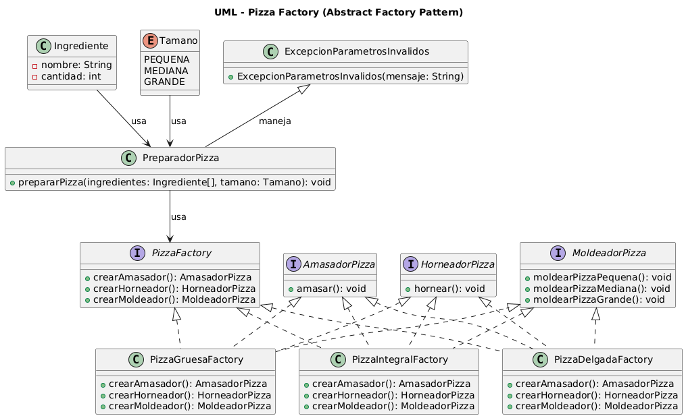

# Pizza Factory - Abstract Factory Pattern

Este proyecto implementa el **patrón de fábrica abstracta** para gestionar diferentes variantes de máquinas de fabricación de pizzas. Se busca desacoplar la lógica básica del proceso de preparación de pizzas de los detalles específicos de amasado, moldeado y horneado.

## Características
- Implementación del **patrón de fábrica abstracta**.
- Soporte para múltiples variantes de máquinas:
  - **Pizza de masa delgada** (convencional).
  - **Pizza de masa gruesa** (masa de pan).
  - **Pizza de masa integral**.
- Código modular y escalable para facilitar futuras extensiones.

## Instalación

Clonar el repositorio:
```bash
git clone https://github.com/CesarAVegaF312/DYAS-GoF-Patterns-Creational-PizzaFactory.git
```

Navegar al directorio del proyecto:
```bash
cd DYAS-GoF-Patterns-Creational-PizzaFactory
```

Compilar y ejecutar con Maven:
```bash
mvn clean install
mvn exec:java -Dexec.mainClass="edu.unisabana.pizzafactory.consoleview.PreparadorPizza"
```

## Estructura del Proyecto
```
📂 edu.unisabana.pizzafactory
├── 📂 consoleview
│   └── PreparadorPizza.java  # Punto de entrada
├── 📂 model
|   ├──fabricas
│   │   ├── PizzaDelgadaFactory.java   # Fábrica para pizza delgada
│   │   ├── PizzaGruesaFactory.java    # Fábrica para pizza gruesa
│   │   ├── PizzaIntegralFactory.java  # Fábrica para pizza integral
|   ├──implementaciones
│   │   ├── AmasadorPizzaDelgada.java   
│   │   ├── AmasadorPizzaGruesa.java    
│   │   ├── AmasadorPizzaIntegral.java  
|   |   ├── HorneadorPizzaDelgada.java   
│   │   ├── HorneadorPizzaGruesa.java    
│   │   ├── HorneadorPizzaIntegral.java 
│   │   ├── MoldeadorPizzaDelgada.java   
│   │   ├── MoldeadorPizzaGruesa.java    
│   │   ├── MoldeadorPizzaIntegral.java  
|
|   ├──interfaces
    │   ├── AmasadorPizza.java     # Interfaz para amasado
    │   ├── HorneadorPizza.java    # Interfaz para horneado
    │   ├── MoldeadorPizza.java    # Interfaz para moldeado
        ├── PizzaFactory.java      # Fábrica abstracta
|
│   ├── Ingrediente.java       
│   ├── Tamano.java            # 
│   ├── ExcepcionParametrosInvalidos.java  # Excepciones
│   │   
```

## UML



## Uso
Para agregar una nueva variante de pizza:
1. Crear una nueva fábrica que implemente `PizzaFactory`.
2. Implementar clases de `Amasador`, `Horneador` y `Moldeador` específicos para la nueva variante.
3. Modificar `PreparadorPizza` para instanciar la nueva fábrica cuando sea necesario.

## Contribución
Las contribuciones son bienvenidas. Para proponer cambios:
1. Hacer un fork del repositorio.
2. Crear una nueva rama con los cambios.
3. Enviar un pull request con la descripción de la mejora.

# 📌 Descripción de Clases y Funciones

## 🎯 `PreparadorPizza.java` (Punto de Entrada)
📂 Ubicación: `edu.unisabana.pizzafactory.consoleview`

- **`public void prepararPizza(Ingredientes[] ingredientes, Tamano tam)`**  
  - Método principal que sigue la secuencia estándar para preparar una pizza:  
    1. Amasado  
    2. Moldeado según tamaño  
    3. Aplicación de ingredientes  
    4. Horneado  
  - Utiliza el **patrón de fábrica abstracta** para desacoplar la lógica de preparación de los detalles específicos.

---

## 🛠️ Interfaces y Modelos

### 🔹 `Amasador.java` (Interfaz de Amasado)
📂 Ubicación: `edu.unisabana.pizzafactory.model.interfaces`

- **Método:**  
  - `public void amasar();` → Define la acción de amasar, implementada en cada variante de pizza.

### 🔹 `Moldeador.java` (Interfaz de Moldeado)
📂 Ubicación: `edu.unisabana.pizzafactory.model.interfaces`

- **Métodos:**  
  - `public void moldearPizzaPequena();`  
  - `public void moldearPizzaMediana();`  
  - `public void moldearPizzaGrande();`  
  - Define el proceso de moldeado para diferentes tamaños.

### 🔹 `Horneador.java` (Interfaz de Horneado)
📂 Ubicación: `edu.unisabana.pizzafactory.model.interfaces`

- **Método:**  
  - `public void hornear();` → Define la acción de horneado, con implementaciones específicas para cada variante.

### 🔹 `Ingrediente.java` (Modelo de Ingrediente)
📂 Ubicación: `edu.unisabana.pizzafactory.model`

- **Descripción:** Representa un ingrediente de la pizza, con atributos como nombre, cantidad y tipo.

### 🔹 `Tamano.java` (Enumeración de Tamaños)
📂 Ubicación: `edu.unisabana.pizzafactory.model`

- **Valores:**  
  - `PEQUENA`, `MEDIANA`, `GRANDE`  
  - Define los tamaños de pizza disponibles.

### 🔹 `ExcepcionParametrosInvalidos.java` (Manejo de Excepciones)
📂 Ubicación: `edu.unisabana.pizzafactory.model`

- **Función:**  
  - Maneja errores cuando el tamaño de la pizza es inválido:  
    ```java
    throw new ExcepcionParametrosInvalidos(“Tamaño de pizza inválido:” + tam);
    ```

---

## 🏭 Implementaciones de Fábricas y Variantes

### 🔹 `PizzaFactory.java` (Fábrica Abstracta)
📂 Ubicación: `edu.unisabana.pizzafactory.model.interfaces`

- **Métodos abstractos que deben implementar las fábricas concretas:**  
  ```java
  public abstract AmasadorPizza crearAmasador();
  public abstract HorneadorPizza crearHorneador();
  public abstract MoldeadorPizza crearMoldeador();


